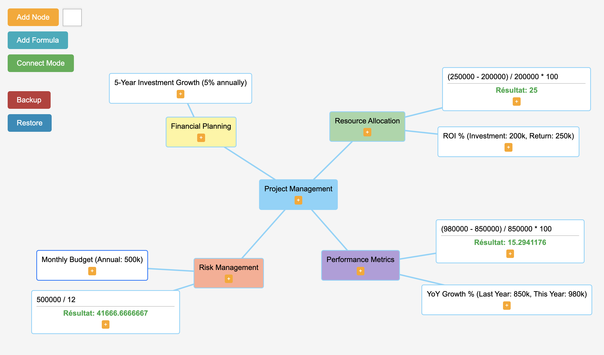

# SimpleMindmap

SimpleMindmap is an intuitive and lightweight web application for creating mind maps. It offers a simple and efficient user interface to visually organize your ideas.

## Features

- **Node Creation**: Easily add new nodes to your mind map.
- **Text Editing**: Double-click on a node to edit its content.
- **Connections**: Link nodes together to establish relationships.
- **Moving**: Drag nodes to reorganize your map.
- **Multiple Selection**: Select multiple nodes by drawing a selection area.
- **Connection Mode**: Activate connection mode to quickly link nodes.
- **Deletion**: Delete nodes individually or in groups.
- **Copy/Cut/Paste**: Use standard keyboard shortcuts to manipulate nodes.
- **Auto-save**: Your work is automatically saved in local storage.
- **Export/Import**: Save your mind map to a file and restore it later.

## Usage

1. Click "Add Node" to create a new root node.
2. Use the "+" button on each node to add child nodes.
3. Double-click a node to edit its content.
4. Drag nodes to reposition them.
5. Use the "Connect Mode" button to link nodes together.
6. Select multiple nodes by drawing a selection area with the mouse.
7. Use keyboard shortcuts (Ctrl+C, Ctrl+X, Ctrl+V) to copy, cut, and paste nodes.
8. Click "Backup" to export your mind map.
9. Use "Restore" to import a previously saved mind map.

## Keyboard Shortcuts

- `Ctrl + C`: Copy selected nodes
- `Ctrl + X`: Cut selected nodes
- `Ctrl + V`: Paste copied/cut nodes
- `Delete`: Delete selected nodes

## Contributing

Contributions are welcome! Feel free to open an issue or submit a pull request.

## License

This project is licensed under the [MIT License](LICENSE).
